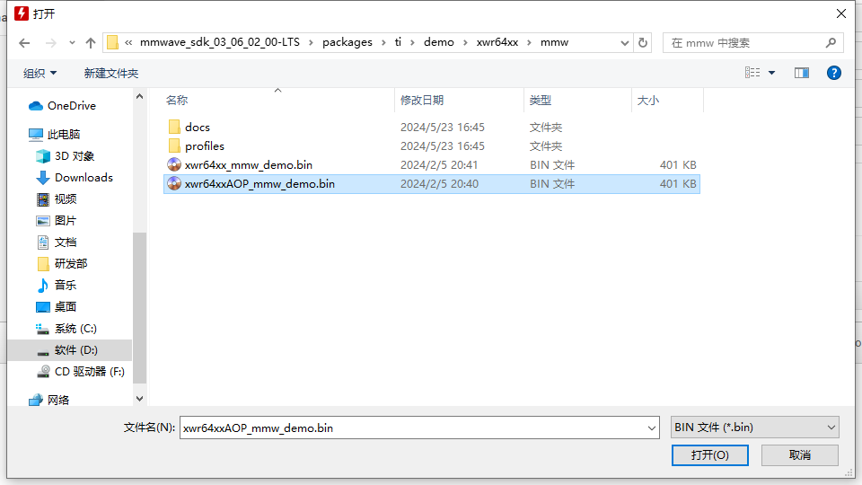
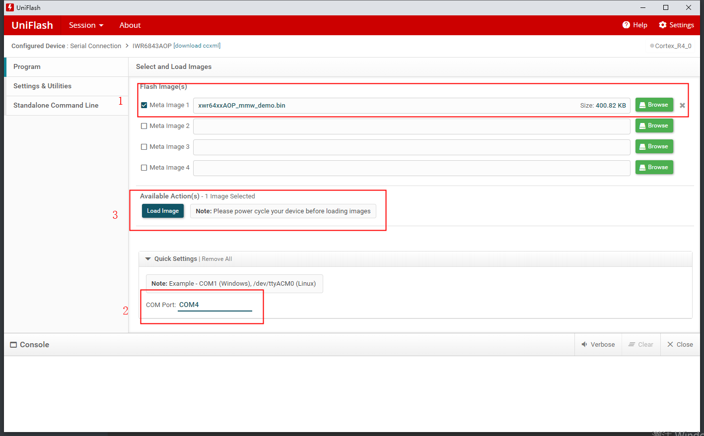
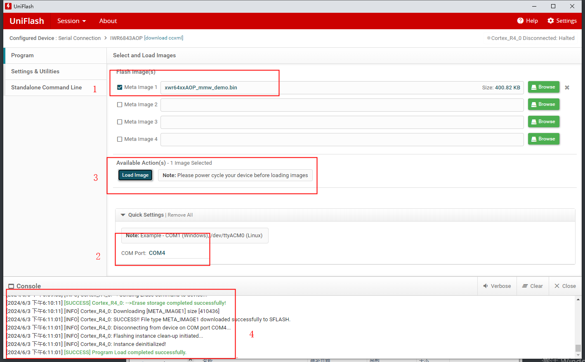
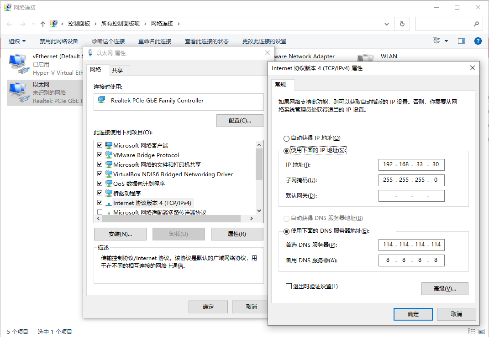
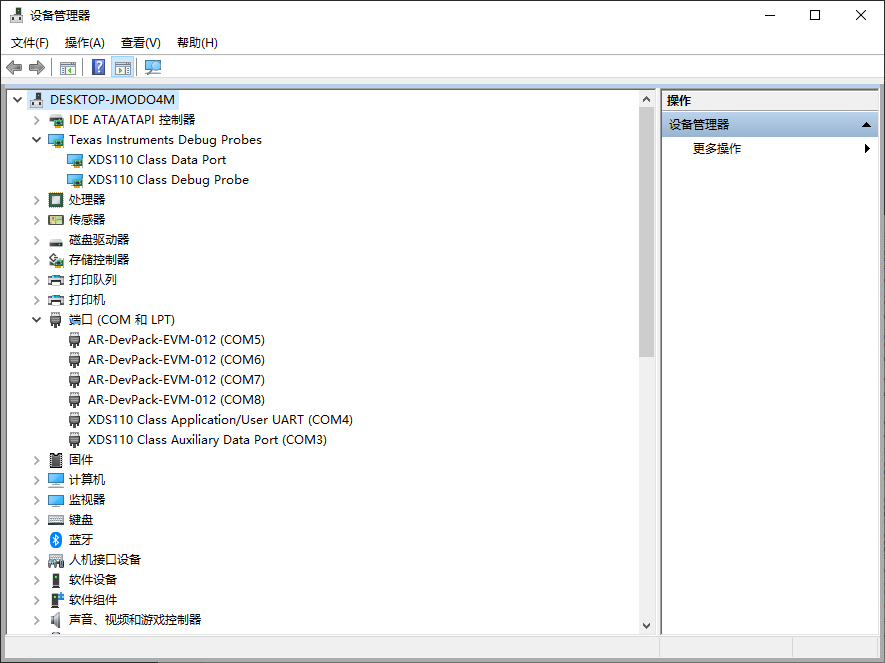
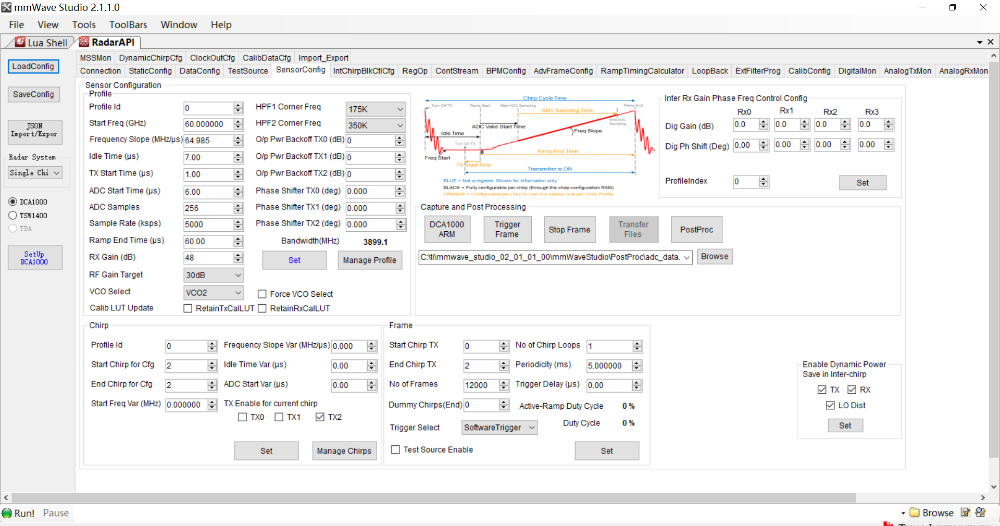

## Environment Setup

### Devices and Systems for Running the Script

​	Device: IWR6843AOP+MMWAVEICBOOST+DCA1000EVM

​	System: Windows10, Ubuntu18.04

### Flashing the provided bin image file from the SDK

​	Path

```cmd
D:\ti\mmwave_sdk_03_06_02_00-LTS\packages\ti\demo\xwr64xx\mmw\xwr64xx_mmw_demo.bin
```

​	Set SOP to flashing mode, then click the `RST` button on top of `MMWAVEICBOOST`.

​	**SOP0 1**
​	**SOP1 0**
​	**SOP2 1**








### Set SOP to development mode

​	After flashing the bin image file, set to development mode, then click the `RST` button on top of `MMWAVEICBOOST`.

​	**SOP0 0**

​	**SOP1 0**

​	**SOP2 1**


## Windows Platform

### Install Driver

​	Unzip `ftdi_driver_2_12.zip`, manually select the local driver.

### Install Dependencies

```bash
pip install -r requirements.txt
```

### Configure IP Address



### Check if ports are correctly recognized




## Linux Platform

### Install FTDI driver for USB communication

```bash
sudo apt-get install libftdi1 libftdi-dev
```

### Check if ports are correctly recognized

```bash
ll /dev/serial/by-id
```

​	Output result:

```bash
total 0
drwxr-xr-x 2 root root 80 Jun   5 10:45 ./
drwxr-xr-x 4 root root 80 Jun   5 10:45 ../
lrwxrwxrwx 1 root root 13 Jun   5 10:45 usb-Texas_Instruments_XDS110__03.00.00.02__Embed_with_CMSIS-DAP_R0081038-if00 -> ../../ttyACM0
lrwxrwxrwx 1 root root 13 Jun   5 10:45 usb-Texas_Instruments_XDS110__03.00.00.02__Embed_with_CMSIS-DAP_R0081038-if03 -> ../../ttyACM1
```

Where `ttyACM0` and `ttyACM1` are the command port and data port respectively.

Port paths are as follows:

```bash
ls /dev
```

Result:

```bash
/dev/ttyACM0
/dev/ttyACM1
```

Where `ttyACM0` corresponds to `COM4` on Windows system

### Configure IP Address

​	Same as Windows platform


## Python Code File

### Python Runtime Environment

```bash
pip instal -r requirements.txt
```

### Notes

1. Log file information is saved in the logs directory of the current directory, the log file name is `mmwave.log`, the log file will be created automatically, no need to create manually.

2. Before running the code, you need to modify the port to the corresponding local port, as shown in the figure `Application/User UART` corresponding port number,

    

    ```python
    def main():
        setup_logging()  # Set up logging
        data_dir = './data'  # Directory for data files
        serial_port_CLI = '/dev/ttyACM0' if platform.system() == 'Linux' else 'COM4'  # Serial port based on OS
        start_time = None  # Initialize start time
        end_time = None  # Initialize end time
    ```

    For Windows platform, modify the `COM4` port on line 200 of the main.py code file

    For Linux platform, modify the `/dev/ttyACM0` port on line 213 of the main.py code file

3. The default baud rate is 115200

4. Enter `q` to exit the program; enter `s` to start the collection task, enter `s` again to end the collection task; enter `r` to reset the board and millimeter-wave radar,

### Run the program

```bash
python main.py
```

### Run the program on Linux version

```bash
bash run.sh
```

​	or

```bash
source mmware/bin/activate
```


## Configuration Files

### cf.json DCA1000EVM Configuration File

The current collection method is automatic collection, the area that needs attention is the `captureConfig` configuration

```json
    "captureConfig": {
      "fileBasePath": "data",
      "filePrefix": "adc_data",
      "maxRecFileSize_MB": 1024,
      "sequenceNumberEnable": 1,
      "captureStopMode": "infinite",
      "bytesToCapture": 4000,
      "durationToCapture_ms": 180000,
      "framesToCapture": 12000
    },
```

Among them, `captureStopMode` is configured as `infinite` collection mode, that is, the DAC1000 board works continuously.



As shown in the figure, in the Frame column, `No of Frames` is 12000, Periodicity is 5ms, the total duration is 60000ms, the collection time is determined by the millimeter-wave radar, and the collection channel is automatically closed after collection is completed.

Other parameters need to refer to the `TI_DCA1000EVM_CLI_Software_UserGuide.pdf` document

```bash
docs/TI_DCA1000EVM_CLI_Software_UserGuide.pdf
```

### profile.cfg IWR6843AOP Millimeter-wave Radar Configuration File

```properties
%* <startIdx> <endIdx>
% <loopNum>[should be 4x] <frameNum> <framePerio:ms>
% <trigSel 1:Software,2:Hardware>[1] <frameTrigDelay:ms>
frameCfg 0 2 16 12000 5 1 0
```

Among them, the `frameCfg` parameter corresponds to the Frame column in the above figure. The third parameter `<loopNum>` cannot be filled with 1, it can only be filled with 16, this value is automatically generated according to `mmWare Demo Visualizer`.

`frameNum` corresponds to `No of Frames`

`framePerio` corresponds to `Periodicity`

`<frameNum>` and `<framePerio:ms>` jointly determine the data collection time length:

​	12000：5 is 60 seconds
​	2000：5 is 10 seconds
​	6000：5 is 30 seconds

Other parameters need to refer to the `mmwave_sdk_user_guide.pdf` document

```bash
docs/mmwave_sdk_user_guide.pdf
```

### Files generated by the script

data/adc_data_Raw_0.bin: Raw data file

data/adc_data_Raw_LogFile.csv: Collection data log file. Windows platform can normally write collection history information, Linux platform needs Ubuntu18.04 platform.

Aug_07_2024_13_46_18_447_Aug_07_2024_13_47_20_827_2.bin: Renamed raw data file.

​	Aug_07_2024_13_46_18_447 is the timestamp of the start of data collection,

​	Aug_07_2024_13_47_20_827 is the timestamp of the end of data collection, accurate to milliseconds,

​	_2 is the file sequence number.

logs/mmwave.log:

​	Python script log


