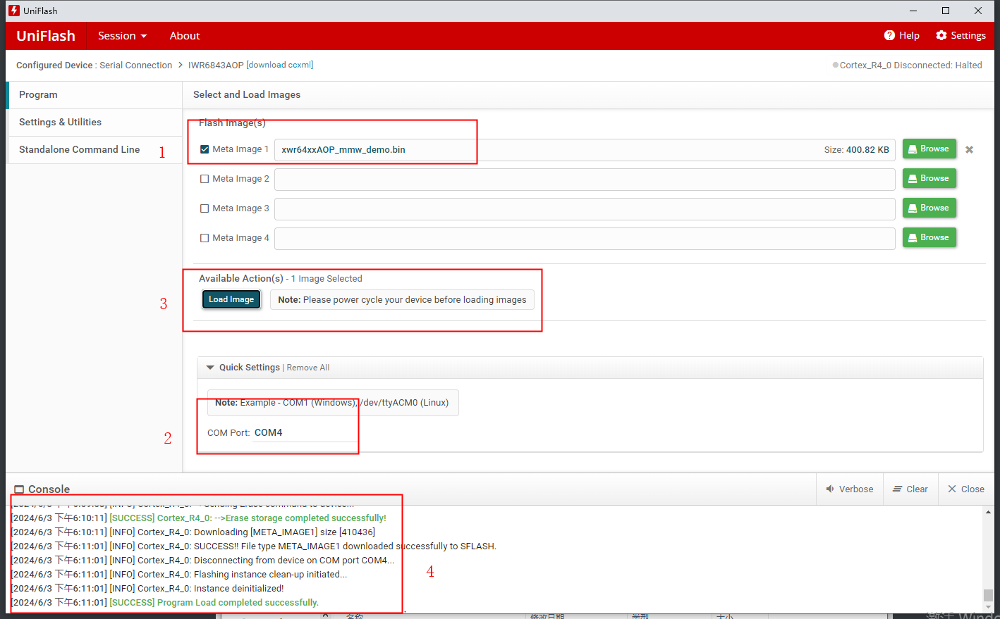
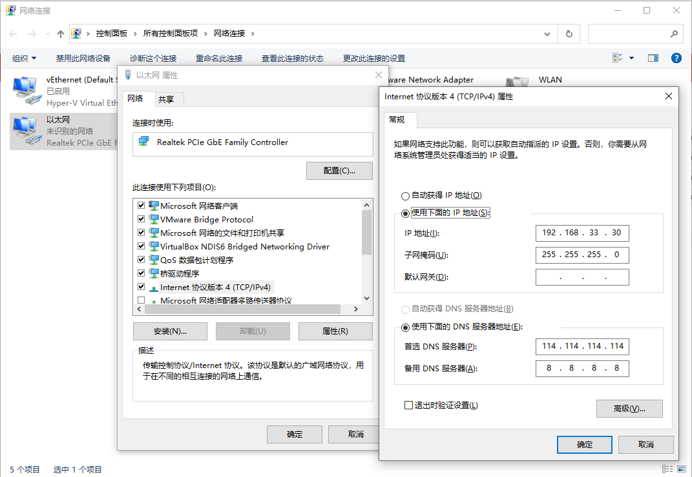

## 运行环境设置

### 该脚本运行的设备和系统

​	设备：IWR6843AOP+MMWAVEICBOOST+DCA1000EVM

​	系统：Windows10、Ubuntu18.04

### 烧录sdk提供的bin镜像文件

​	路径

```cmd
D:\ti\mmwave_sdk_03_06_02_00-LTS\packages\ti\demo\xwr64xx\mmw\xwr64xx_mmw_demo.bin
```

​	设置SOP为烧录模式，然后点击`MMWAVEICBOOST`上面的`RST`按钮。

​	**SOP0 1**
​	**SOP1 0**
​	**SOP2 1**





### 设置SOP为开发模式

​	烧录完成bin镜像文件后，设置为开发模式，然后点击`MMWAVEICBOOST`上面的`RST`按钮。

​	**SOP0 0**

​	**SOP1 0**

​	**SOP2 1**


## Windows平台

### 安装驱动

​	解压缩`ftdi_driver_2_12.zip`，手动选择本地驱动程序。

### 安装依赖环境

```bash
pip install -r requirements.txt
```

### 配置IP地址



### 检测端口是否正确识别


## Linux平台

### 安装驱动FTDI driver for USB communication

```bash
sudo apt-get install libftdi1 libftdi-dev
```

### 检测端口是否正确识别

```bash
ll /dev/serial/by-id
```

​	输出结果为

```bash
total 0
drwxr-xr-x 2 root root 80 6月   5 10:45 ./
drwxr-xr-x 4 root root 80 6月   5 10:45 ../
lrwxrwxrwx 1 root root 13 6月   5 10:45 usb-Texas_Instruments_XDS110__03.00.00.02__Embed_with_CMSIS-DAP_R0081038-if00 -> ../../ttyACM0
lrwxrwxrwx 1 root root 13 6月   5 10:45 usb-Texas_Instruments_XDS110__03.00.00.02__Embed_with_CMSIS-DAP_R0081038-if03 -> ../../ttyACM1
```

其中`ttyACM0`和`ttyACM1`分别是命令端口和数据端口。

端口路径如下

```bash
ls /dev
```

结果如下：

```bash
/dev/ttyACM0
/dev/ttyACM1
```

其中`ttyACM0`对应Windows系统下的`COM4`

### 配置IP地址

​	同Windows平台一样


## Python代码文件

### Python运行环境

```bash
pip instal -r requirements.txt
```

### 提示

1. 日志文件信息保存在当前目录logs目录中，日志文件名称为`mmwave.log`，日志文件会自动创建，无需手动创建。

2. 运行代码之前，需要修改端口为本地对应的端口，如图`Application/User UART`对应的端口号，

    

    ```python
    def main():
        setup_logging()  # Set up logging
        data_dir = './data'  # Directory for data files
        serial_port_CLI = '/dev/ttyACM0' if platform.system() == 'Linux' else 'COM4'  # Serial port based on OS
        start_time = None  # Initialize start time
        end_time = None  # Initialize end time
    ```

    Windows平台修改mian.py代码文件第200行处的`COM4`端口

    Linux平台修改main.py代码文件第213行处的`/dev/ttyACM0`端口

3. 波特率默认使用115200

4. 输入`q`退出程序；输入`s`开始采集任务，再次输入`s`结束采集任务；输入`r`重置板子和毫米波雷达，

### 运行程序

```bash
python main.py
```

### Linux版本运行程序

```bash
bash run.sh
```

​	或者

```bash
source mmware/bin/activate
```


## 配置文件

### cf.json DCA1000EVM配置文件

目前采集的方式是自动采集，需要关注的地方是`captureConfig`配置

```json
    "captureConfig": {
      "fileBasePath": "data",
      "filePrefix": "adc_data",
      "maxRecFileSize_MB": 1024,
      "sequenceNumberEnable": 1,
      "captureStopMode": "infinite",
      "bytesToCapture": 4000,
      "durationToCapture_ms": 180000,
      "framesToCapture": 12000
    },
```

其中，`captureStopMode`配置为`infinite`采集方式，即DAC1000板子持续不停工作。


如图，在Frame栏中，`No of Frames`是12000，Periodicity是5ms，总时长是60000ms，采集时间由毫米波雷达决定，采集完成自动关闭采集通道。

其他参数需要参考`TI_DCA1000EVM_CLI_Software_UserGuide.pdf`文档

```bash
docs/TI_DCA1000EVM_CLI_Software_UserGuide.pdf
```

### profile.cfg IWR6843AOP毫米波雷达配置文件

```properties
%* <startIdx> <endIdx>
% <loopNum>[should be 4x] <frameNum> <framePerio:ms>
% <trigSel 1:Software,2:Hardware>[1] <frameTrigDelay:ms>
frameCfg 0 2 16 12000 5 1 0
```

其中，`frameCfg`参数是和上图Frame栏对应的。其中第三个参数`<loopNum>`不能填1，只能填16，这个值是根据`mmWare Demo Visualizer`自动生成的。

`frameNum`对应`No of Frames`

`framePerio`对应`Periodicity`

`<frameNum>`和`<framePerio:ms>`共同决定采集数据时间长度：

​	12000：5为60秒
​	2000：5为10秒
​	6000：5为30秒

其他参数需要参考`mmwave_sdk_user_guide.pdf`文档

```bash
docs/mmwave_sdk_user_guide.pdf
```

### 脚本生成的文件

data/adc_data_Raw_0.bin：原始数据文件

data/adc_data_Raw_LogFile.csv：采集数据日志文件。Windows平台可以正常写入采集历史信息，Linux平台需要在Ubuntu18.04平台。

Aug_07_2024_13_46_18_447_Aug_07_2024_13_47_20_827_2.bin：重命名后的原始数据文件。

​	Aug_07_2024_13_46_18_447是开始采集数据的时间戳，

​	Aug_07_2024_13_47_20_827是结束采集数据的时间戳，精确到毫秒，

​	_2是文件序号。

logs/mmwave.log：

​	python脚本日志

## 资源

### 百度网盘

```http
https://pan.baidu.com/s/12emzddZH6rp2p-x7Q-Xd-A?pwd=zzbo
```

提取码

```bash
zzbo
```

###  OneDrive

```http
https://1drv.ms/u/s!Ar3wCCpzemccrJIMb6t57oU8tkDdYw?e=ESfGD1
```

